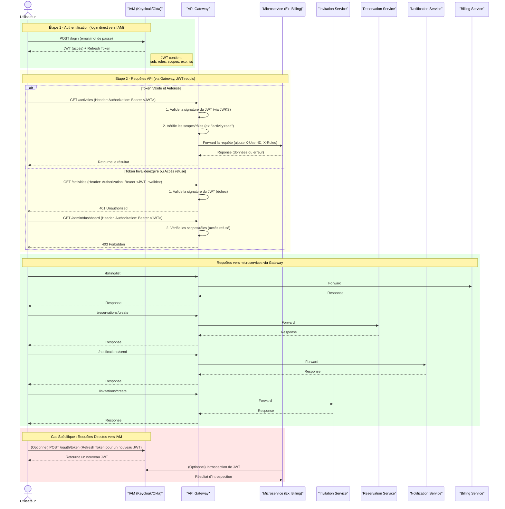

# amcloud-gateway

## Description
amcloud-gateway is the API Gateway microservice for the amcloud-platform ecosystem.  
It centralizes and manages routing, authentication, and authorization for other microservices, enabling secure and efficient communication.

## Prerequisites

- Java JDK 17 or higher
- Maven 3.9+
- [Optional] Docker (for deployment)
- Git

## Repository Structure

```
amcloud-gateway/
├── spring-cloud-gateway/         # Main Spring Boot gateway source code
│   ├── src/
│   ├── pom.xml
│   └── ...
├── .github/                      # GitHub workflows, issue templates, etc.
├── docs/                         # Documentation and diagrams
└── README.md
```

## Environment Configuration

A `.env` file **must** be present at the root of `spring-cloud-gateway/` before running or testing the microservice.  
Example content:

```
# === Gateway Configuration ===
GATEWAY_SERVER_PORT=8080
GATEWAY_APPLICATION_NAME=gateway

# === IAM Configuration ===
IAM_ROUTE_URI=http://localhost:8081
IAM_ROUTE_PATH=/auth/**

# === Other Services Configuration ===
BILLING_ROUTE_URI=http://localhost:8082
BILLING_ROUTE_PATH=/billing/**

RESERVATION_ROUTE_URI=http://localhost:8083
RESERVATION_ROUTE_PATH=/reservations/**

INVITATION_ROUTE_URI=http://localhost:8084
INVITATION_ROUTE_PATH=/invitations/**

NOTIFICATION_ROUTE_URI=http://localhost:8085
NOTIFICATION_ROUTE_PATH=/notifications/**
```

> ⚠️ **Never commit sensitive values (tokens, passwords) into the repository.**  
> Use placeholders and configure secrets securely in your deployment environments.

## Installation & Build

```bash
git clone https://github.com/Project-In3-Uds/amcloud-gateway.git
cd amcloud-gateway/spring-cloud-gateway
mvn clean install
```

## Running the Microservice

You can start the gateway with:

```bash
mvn spring-boot:run
```

Or build the JAR and run:

```bash
mvn package
java -jar target/gateway-0.0.1-SNAPSHOT.jar
```

## Basic API Usage

By default, the gateway runs on `http://localhost:8080/`.

To route requests to a service:
```bash
curl http://localhost:8080/{service}/{endpoint}
```
Example:
```bash
curl http://localhost:8080/billing/list
```

## Technologies Used

- Java 17
- Spring Boot 3.x (API Gateway)
- Spring Cloud Gateway
- Maven
- Docker (optional)
- GitHub Actions (CI/CD)

## Architecture Overview

Below is a corrected diagram showing the flow where authentication (login) is handled directly by IAM, while all other API requests pass through the Gateway:



## Known Issues / Limitations

- Requires IAM service for authentication and JWT validation.
- Hot-reloading of routes is dependent on client microservice capabilities.
- No rate-limiting or circuit breaker by default (consider adding these features in production).

## Support / Contact

- For questions or support, [open an issue](https://github.com/Project-In3-Uds/amcloud-gateway/issues).
- For real-time discussion, contact us at project.in3.uds@outlook.com.

## Contribution

We welcome contributions! Please read our [CONTRIBUTING.md](CONTRIBUTING.md) and [CODE_OF_CONDUCT.md](CODE_OF_CONDUCT.md) before submitting a pull request.

## License

This project is licensed under the Apache License 2.0. See the [LICENSE](LICENSE) file for details.

## Credits

Developed by Project-In3-Uds contributors.  
Special thanks to all open-source libraries and the community!